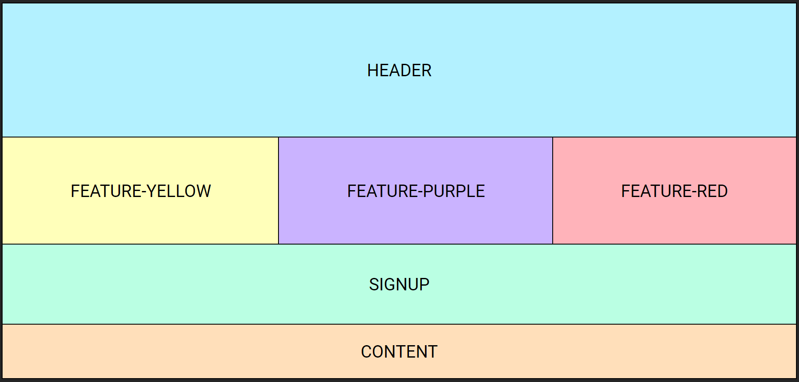
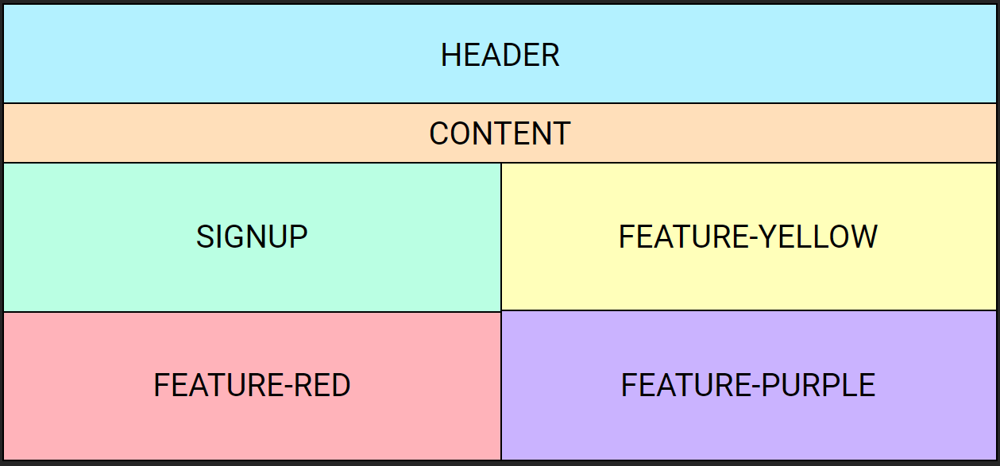
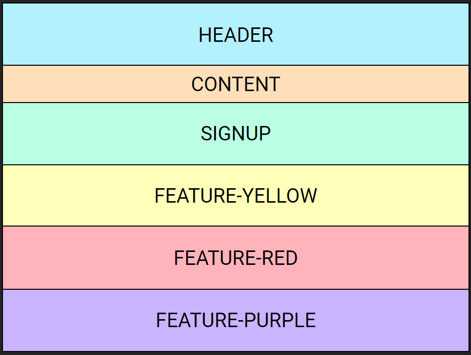
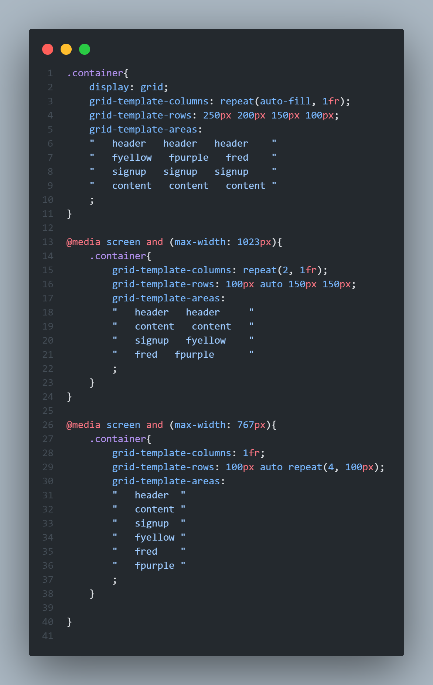

# Grid Layout ⊞⊞⊞

Grid é um tipo de **display** do css, assim como o **flex**, serve para manipular o layout da página web, o diferencial é que, com o grid, podemos transformar nossa página em vários quadrados e neles atribuir espaços específicos, como HEADER, FOOTER, etc...

Com esse método, podemos utilizar a responsividade de uma forma única e didática.

> Tela grande

> Tablet

> Celular

Para quem está acostumado a utilizar o flex, pode estranhar a maneira como o grid é utilizado. Em casos específicos, o grid segue com vantagem, principalmente quando precisamos criar layouts mais complexos e alinhamentos precisos. A utilização de grid pode ser extremamente poderosa. Ele permite que você crie interfaces de usuário altamente responsivas e bem estruturadas, tal como o flex, porém em situações específicas.

Não se esqueça de deixar uma ⭐ nesse repositório!
